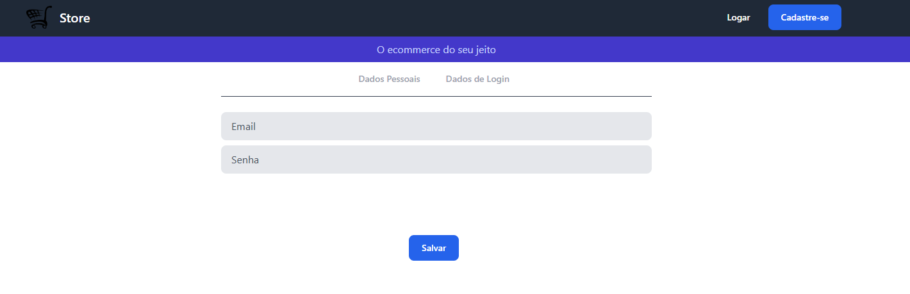
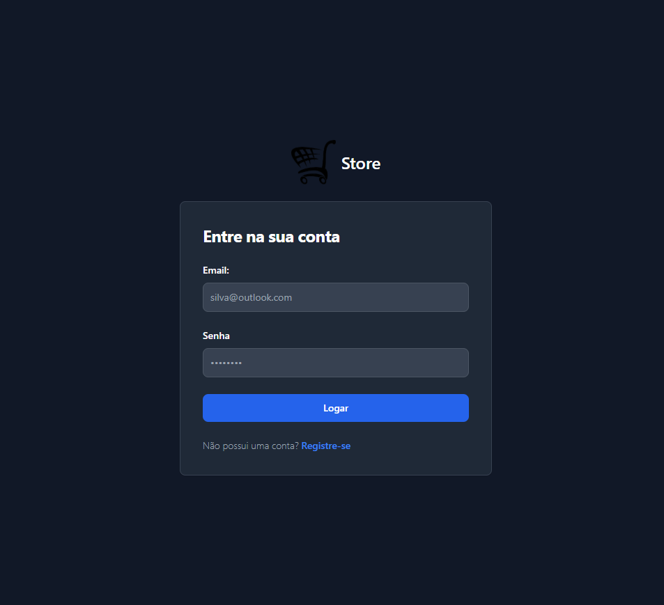
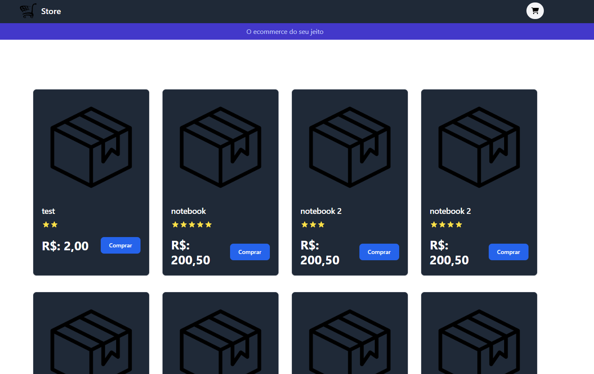
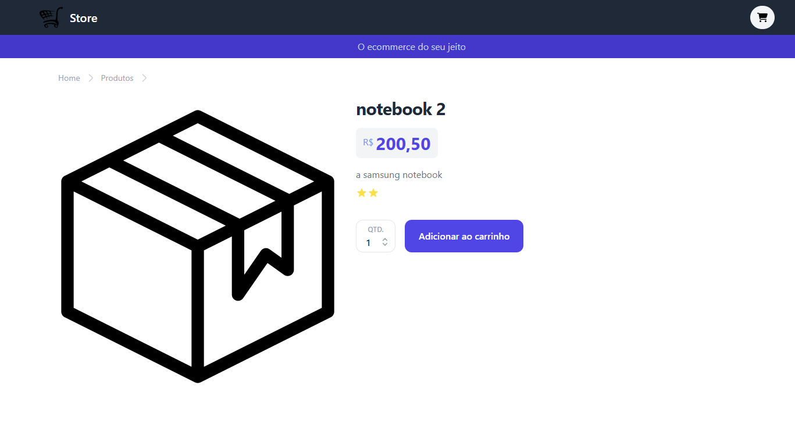

Levantar a aplicação:

1° - npm install

2° - npm start

3° - Levantar o server side: https://github.com/ViniciusGuterres/ecommerce-api-node

Views:

* Cadastro de usuário:

* Login

* Home 

* Detalhes do produto

